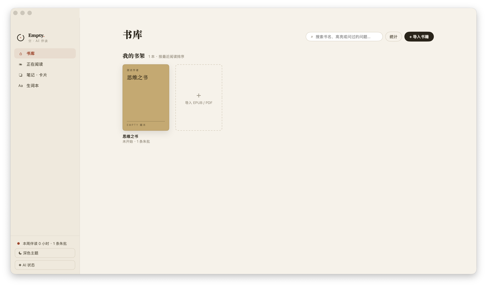
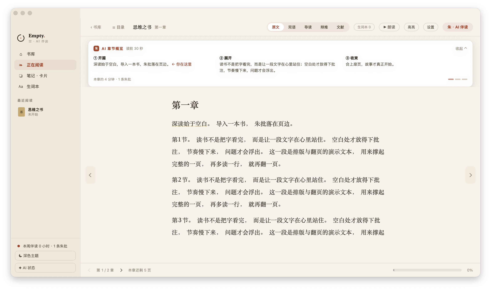
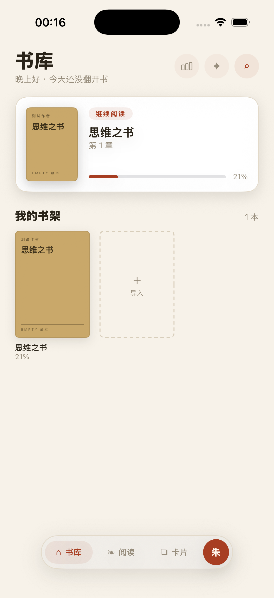
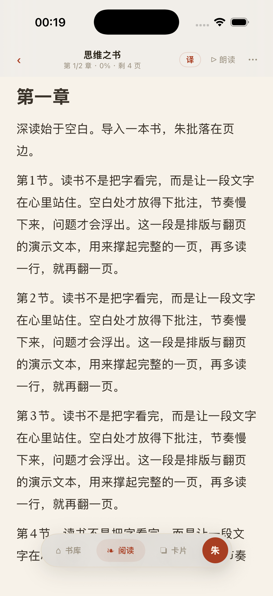

# 空 · Empty

[](https://github.com/DaviRain-Su/empty/actions/workflows/ci.yml)

**AI 伴读 · 深读工作台**

多平台 SwiftUI 阅读应用：在**不剧透**的前提下，用 AI 帮你摘要、问书、记笔记、复习词汇。  
Mac 是完整的「深读工作台」；iOS / iPad 提供轻量阅读与 AI 辅助。

> *空是底，朱是点 —— 应用是空房间，AI 是页边那一笔朱批。*

**官网：** [empty-78c.pages.dev](https://empty-78c.pages.dev) · [GitHub](https://github.com/DaviRain-Su/empty)

---

## 截图

以下均为**真实应用界面**截屏（非概念图）。重新生成见 [docs/screenshots/README.md](docs/screenshots/README.md)。

### macOS · 书库

深读工作台书库：继续阅读卡片、书架与导入入口。



### macOS · 阅读

双语对照模式、AI 章节概览与 EPUB 阅读器。



### iOS · 书库

随身伴读书库 Tab，继续阅读与导入。



### iOS · 阅读

阅读 Tab：章节进度、「译」与「朗读」、底部胶囊导航与「朱」按钮。



---

## 特性

### 阅读

- **EPUB / PDF 导入与阅读** — EPUB 走原生 SwiftUI 块模型渲染（XHTML 解析为标题 / 段落 / 引文 / 列表 / 表格 / 脚注 / 图片块，纵向滚动，不经 WebView），PDF 走 PDFKit；暗色模式、字体与行距调节
- **高亮与批注** — 精确 UTF-16 锚定 + 前后文消歧，按准确范围绘制；高亮列表内可写 / 编辑批注，点击精确跳回原文位置
- **划词与跨段选取** — 段内原生精确划词；「跨段」打开整章选取面板（自动定位当前阅读位置），选区回到同一套解释 / 翻译 / 高亮流程
- **阅读进度** — 章内字符级（`utf16Offset`）进度与会话记录，滚动即上报，续读落回段内精确位置

### 防剧透 AI

所有 AI 功能只基于**你已经读过的文本**，在数据层过滤未读内容，而非仅靠 prompt 约束：

- **章节摘要 / Recap** — 「Previously on…」式回顾；Mac 阅读器内为 ①②③ 结构化章节概览（含「← 你在这里」与本章时长估计）
- **今译 / 导读 / 辩难 / 文献**（EPUB）— Mac 为左右分栏双语 + 文内镜片，iOS 为段下镜片；**预译 + 永不阻塞**：原文先渲染、当前镜片从本地缓存补齐，云端阅读时自动预热后两章的当前镜片，**不重复翻译 / 不重复生成**（`TranslationStore` 持久缓存，☰ 目录里可见双语章节预译状态与全书缓存量）
- **朱 · 阅读 Agent** — 伴读对话由模型自主调度阅读工具（查已读 / 回顾 / 解释 / 找关联 / 建议生词 / 生成闪卡），步骤轨迹在对话中可见，**写操作一律待确认**；工具全部走防剧透管线，失败自动回退 grounded 问答。Mac 为侧栏面板，iOS 为「朱」半屏 sheet，答案可「存为卡片」
- **词汇释义** — 选中查词，接入间隔复习
- **思维链接** — 跨书高亮的主题关联发现，可存为链接卡（Mac + iOS）
- **书库「上次读到」**（Mac）— 防剧透 AI 回顾 + 剩余阅读时长估计；iOS 书库有「朱批 · 今日伴读」复习提醒

### 学习工具（Mac）

- **笔记屏** — 高亮卡片 + 问答卡 / 链接卡 / 复习卡（卡内即可间隔复习），知识图谱可展开为完整图谱
- **词汇屏** — Ebbinghaus 间隔复习（1 → 2 → 4 → 7 → 15 → 30 天），挖空例句 + 下次队列预告
- **朗读**（macOS TTS）

### AI 提供商

| 模式 | 说明 |
|------|------|
| **On-Device**（默认） | Apple Foundation Models，本地、免费、私密 |
| **Cloud（BYOK）** | 两套标准:**OpenAI 兼容**（DeepSeek 预设）与 **Anthropic 兼容**（Kimi Code 预设）；密钥存 Keychain |

Kimi Code 走 Anthropic Messages 接口(会员 Code 权益,密钥在 kimi.com/code/console 创建)。在侧栏 **AI 状态**（`AIDiagnosticsView`）里选接口标准/预设、填密钥并做连通性测试。

---

## 平台支持

| 平台 | 体验 |
|------|------|
| **macOS** | 完整四屏工作台：书库 / 阅读 / 笔记 / 词汇 |
| **iOS / iPadOS** | 随身伴读：书库 / 阅读 / 卡片 + 朱 AI 半屏对话、「译」逐段双语、思维链接、卡片与生词复习 |
| **visionOS** | 可编译，暂无专属 UI |

**系统要求：** Xcode 26+；项目默认部署目标 iOS / macOS **26.2**，CI 会以 iOS 18 / macOS 15 覆盖 availability fallback  
**CI：** GitHub Actions 在 `macos-latest` 上串行运行 `EmptyTests`，并单独构建 iOS Simulator
**Bundle ID：** `davirian.Empty`

---

## 快速开始

### 1. 克隆仓库

```bash
git clone https://github.com/DaviRain-Su/empty.git
cd Empty
```

### 2. 用 Xcode 打开

```bash
open Empty.xcodeproj
```

选择目标平台（My Mac / iPhone Simulator），`Cmd + R` 运行。

### 3. 导入书籍

点击 **导入**，选择 `.epub` 或 `.pdf` 文件。

### 4. 配置 AI（可选）

1. 打开 **AI 诊断** 面板
2. 默认使用本机 Apple Intelligence；若不可用，可切换到 Cloud 并填入 API Key
3. 运行一次 Summarize 测试确认管线正常

---

## 运行测试

```bash
# macOS 单元测试（与 CI 一致：串行，跳过 UI 测试）
xcodebuild test -project Empty.xcodeproj -scheme Empty \
  -destination 'platform=macOS' \
  -parallel-testing-enabled NO \
  -only-testing:EmptyTests \
  -skip-testing:EmptyUITests \
  CODE_SIGNING_ALLOWED=NO \
  MACOSX_DEPLOYMENT_TARGET=15.0 \
  IPHONEOS_DEPLOYMENT_TARGET=18.0

> 若自定义其它 `xcodebuild` 命令，本地也可追加
> `CODE_SIGNING_ALLOWED=NO CODE_SIGNING_REQUIRED=NO CODE_SIGN_IDENTITY=""`
> 绕过 iCloud entitlement 签名。

当前 **235/235** 单元测试全部通过；UI smoke / 截图测试在 `EmptyUITests` 中单独运行。

---

## 架构概览

```
┌─────────────────────────────────────────────────────────┐
│  SwiftUI Views                                          │
│  MacRootView / IOSRootView / ReadingView / Companion    │
└────────────────────────┬────────────────────────────────┘
                         │
┌────────────────────────▼────────────────────────────────┐
│  Services                                             │
│  Library · BookIndexer · ChunkRetriever · AIService   │
└────────────┬───────────────────────┬──────────────────┘
             │                       │
   ┌─────────▼─────────┐   ┌─────────▼─────────┐
   │  Synced Store     │   │  Local Store      │
   │  (local / iCloud) │   │  (device-only)    │
   │  Book, Highlight  │   │  Chapter, Chunk   │
   │  Session, Vocab   │   │  + embeddings     │
   │  StudyCard        │   │                   │
   │  + folder/server   │   │                   │
```

核心设计原则：**同步读者的数据，不同步书籍正文。**  
现在的使用心智可以很简单：
- **最省心**：直接用 **iCloud**
- **想自己选目录**：用 **文件夹备份**
- **想跨平台 / 自建**：填 **Empty Cloud / 自建 Server**，再打开自动同步

实时同步现在可在 **仅本机 / iCloud** 间切换；第三方云路径已支持**文件夹快照备份**、**兼容 HTTPS snapshot API 的 server 快照**、面向 contract-ready server 的**自动同步 + 本地 mutation journal 增量推送 + 失败后自动重试 + 系统后台唤醒调度壳层**，以及对兼容 server 的**Passkey 账号壳层**。跨 store 仍只通过 `Book.id` 关联。详见 [docs/ARCHITECTURE.md](docs/ARCHITECTURE.md) 与 [docs/SYNC-BACKUP-DESIGN.md](docs/SYNC-BACKUP-DESIGN.md)。

---

## 项目结构

```
Empty/
├── Empty/                 # 主应用
│   ├── Models/            # SwiftData 模型
│   ├── Services/          # 业务逻辑与 AI 管线
│   ├── Views/             # SwiftUI 视图
│   │   └── Mac/           # macOS 深读工作台
│   └── DesignSystem/      # 朱批设计系统
├── EmptyTests/            # 单元测试（Swift Testing + XCTest）
├── EmptyUITests/          # UI smoke + 截图测试（播种演示书）
├── docs/                  # 架构与开发文档
│   └── screenshots/       # README 与官网用图
└── website/               # 静态落地页（Cloudflare Pages）
```

---

## 推送到 GitHub

本地已完成初始提交后，在 GitHub 新建空仓库（不要勾选 README / .gitignore，避免冲突），然后：

```bash
git remote add origin https://github.com/DaviRain-Su/empty.git
git branch -M main
git push -u origin main
```

若使用 SSH：

```bash
git remote add origin git@github.com:DaviRain-Su/empty.git
git push -u origin main
```

**推送前建议检查：**

- `.gitignore` 已排除 `xcuserdata/`、`DerivedData/` 等本地文件
- 不要在仓库中提交 API Key（密钥通过 Keychain 存储）
- 项目已包含 `Empty.entitlements`；若要启用 iCloud 实时同步，在 Xcode 中确认 Signing & Capabilities 已启用 iCloud / CloudKit

---

## 路线图

- [x] 章内阅读位置（`utf16Offset`）上报，实现精细防剧透
- [x] 语义检索中文支持（语言感知 embedding）
- [x] 闪卡 UI（高亮生成 + 间隔复习）
- [x] iOS 词汇 / 笔记 / 学习 Tab
- [x] 可插拔同步基础版：实时同步可在「仅本机 / iCloud」切换，第三方云先支持文件夹快照备份 / 恢复（`SyncSettingsView`）
- [x] Empty Cloud / 自建 server 壳层：兼容 snapshot API 的 HTTPS 目标可在设置里保存、测试连接、上传 / 恢复最新快照（仍不是 live sync）
- [x] live sync 协议层：`ReaderLiveSyncDelta`、cursor / tombstone / pull / push 契约、iCloud / Empty Cloud provider 状态探测
- [x] Empty Cloud 自动同步基础版：contract-ready server 已支持自动拉取、基于本地 mutation journal 的增量 / tombstone 推送、失败后排队重试、cursor / 指纹持久化、iOS/macOS 系统后台唤醒调度壳层，以及更简单的设置页引导
- [x] Passkey 账号壳层基础版：兼容 server 可探测 `empty-passkey-auth-v1`，支持创建 / 登录 / 刷新 / 退出账号，会话 token 入 Keychain，设置页默认走更简单的账号心智
- [x] PDF 阅读支持（PDFKit 分页阅读 + 按页索引）
- [x] PDF 划词与高亮（选区接入 AI 操作，高亮以 PDF 注释渲染）
- [x] Mac 笔记屏 AI 主题建议
- [x] 双语对照 / 导读逐段在文内展开（对齐 01 Mac 原型）
- [x] 结构化章节概览（①②③ + 你在这里 + 时长）、「存为卡片 / 链接卡」、完整知识图谱
- [x] 书库 hero AI「上次读到」与剩余时长、生词挖空复习与下次队列预告
- [x] iOS 随身伴读对齐 02 原型：书库 / 阅读 / 卡片 + 朱 半屏 AI、「译」逐段双语、思维链接、今日伴读
- [x] 预译 + 翻译持久化（设计第 2 轮）：Mac 左右分栏双语、本地译文缓存与可视化、☰ 章节目录面板
- [x] 阅读 Agent v1：工具化现有能力 + 双路 agent loop（on-device guided generation / cloud JSON mode）、步骤轨迹、写操作确认
- [x] Kimi Code（Anthropic 兼容）云端路径 + 接口标准切换
- [x] EPUB 渲染线从 WebView 迁移到原生 SwiftUI：块模型解析、精确高亮 / 选区、跨段选取、高亮批注与精确跳回
- [x] **ReaderMemory Phase 1/2 + 1b 基础版**（见 [docs/READER-MEMORY-PLAN.md](docs/READER-MEMORY-PLAN.md)）：跨书记忆 ingest/recall、伴读 `recall_reader_memory`、`propose_memory` 确认写入、本地 `MemoryEmbedding` 持久语义路、旧问答压缩为 `theme`、思维链接走记忆召回路
- [x] **活思维链接基础升级**（见 [docs/LIBER-PORT-PLAN.md](docs/LIBER-PORT-PLAN.md) Wave 1）：链接卡 / 主题记忆可参与 `ThoughtLinkFinder`，AI theme/why 仍按需生成
- [ ] 真后台 Empty Cloud live sync / 更完整冲突策略 / Liber 互通 / Walrus 便携层（当前已有 local/iCloud live sync + folder/server snapshot backup + auto sync + local mutation journal + queued retry + background scheduling shell + passkey account shell）
完整变更记录见 [CHANGELOG.md](CHANGELOG.md)。架构与规划见 [docs/ARCHITECTURE.md](docs/ARCHITECTURE.md)。

---

## 许可证

[MIT License](LICENSE) — Copyright © 2026 davirian

---

## 致谢

设计系统「朱批 Vermilion」来自 Empty. 空 产品原型。  
AI 层抽象参考 Apple Foundation Models 与 OpenAI 兼容 API 的最佳实践。