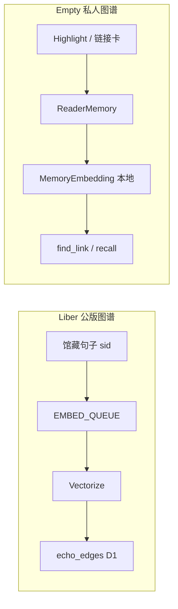

# Liber → Empty 功能借鉴规划

本文档对照 [Liber](https://github.com/DaviRain-Su/liber)（Web · Cloudflare · CC0 开放图书馆）与 **Empty**（原生 Swift · 个人深读工作台），梳理可借鉴的产品能力与实现思路，并给出分阶段落地顺序。

相关文档：[ARCHITECTURE.md](./ARCHITECTURE.md) · [READER-MEMORY-PLAN.md](./READER-MEMORY-PLAN.md)

---

## 1. 两个产品各自是什么

| 维度 | Liber | Empty |
|------|-------|-------|
| 形态 | Vite + React SPA + Cloudflare Pages Functions | SwiftUI 原生 App（macOS / iOS） |
| 书从哪来 | CC0 / 公版馆藏 + Gutenberg/Wikisource 导入管线 | 用户自导入 EPUB/PDF |
| 核心叙事 | 开放图书馆、可引用、可 fork、Agent-friendly | 私密深读、**防剧透**、朱批伴读 |
| AI | Workers AI + 可选 Agent 工具循环（`functions/lib/agent.ts`） | `ReadingAgent` + 本机 FM / 云端 BYOK |
| 跨书关联 | **Echoes**（馆藏句级呼应 + 活知识图谱） | **思维链接**（用户高亮词法匹配） |
| 账号 | Guest / 钱包 / **Passkey** | 暂无账号；CloudKit 预留 |
| 社交 | Feed、共读组、对话卡 fork 树 | 无（个人学习工具） |
| 链 / 存储 | Walrus / Sui 可选证明层 | 本地 SwiftData；正文不上云 |

**结论**：不是把 Liber「搬」成 Empty，而是 **借 Liber 已验证的阅读/Agent/图谱思路，强化 Empty 的差异化（防剧透 + 原生离线 + 个人记忆）**。

---

## 2. 功能对照总表

| Liber 能力 | Empty 现状 | 借鉴价值 | 建议 |
|------------|------------|----------|------|
| **跨书 Echoes（活图谱）** | `ThoughtLinkFinder` 词法匹配用户高亮 | ★★★★★ | **P0** — 并入 ReaderMemory + 语义边 |
| Echo 浮层 UI（主题 + 星座图 + why） | 思维链接 chip / 卡片 | ★★★★☆ | **P1** — 升级链接卡展示 |
| **阅读 Agent + 工具**（`get_echoes` / `read_passage` / `search`） | `ReadingAgent` v1 已落地 | ★★★★☆ | **P0** — 工具名与行为对齐 |
| **Lens / Persona**（今译、辩难、文献学… 8 模式） | 单一伴读人格 | ★★★★☆ | **P1** — 伴读「镜片」切换 |
| **古文今译** 一键模式 | `TranslationStore` 双语对照 | ★★★☆☆ | **P2** — 选中句「今译」快捷入口 |
| **对话卡 / 金句卡** + fork 谱系 + PNG | `StudyCardKind.qa` / `.link`，无 fork | ★★★☆☆ | **P2** — 卡片溯源与分享图 |
| **Notebook** 高亮归档 + Markdown 导出 | Mac 笔记屏 + 卡片 | ★★★☆☆ | **P2** — 导出管线 |
| 阅读布局（经典 / 档案 / 沉浸 / **竖排**） | WebKit 分栏 + 字体调节 | ★★★☆☆ | **P2** — 竖排、繁简（古文向） |
| 章节切分（论语篇、史书卷、词牌…） | `EPUBParser` 按 spine | ★★☆☆☆ | **P3** — 仅在做公版内置书库时 |
| Gutenberg / Wikisource 导入 CLI | 用户自导入 | ★★☆☆☆ | **不做** — 产品形态不同 |
| **Passkey 登录** | 无 | ★★★☆☆ | **P3** — 借实现思路，见 MEMORY 方案 |
| 社交 Feed / 共读组 / 讨论串 | 无 | ★☆☆☆☆ | **不做** |
| 榜单 Charts / Agent Square | 无 | ★☆☆☆☆ | **不做** |
| MCP / Agent View 开放层 | 无 | ★★☆☆☆ | **P4** — 远期「导出 Agent 可读笔记」 |
| Walrus / Sui 链上证明 | 无 | ★☆☆☆☆ | **不做主路径** — 见 MEMORY 方案 Walrus 节 |
| Workers 语义索引 / Vectorize | 本地 `SemanticIndexer` + NLEmbedding | ★★★☆☆ | **P1b** — 借鉴管线思想，本地实现 |

---

## 3. Liber 里值得精读的实现（给移植时对照）

| Liber 路径 | 借什么 |
|------------|--------|
| `docs/KNOWLEDGE_GRAPH_SPEC.md` | 活 **echo_edges**：写入触发 embed → 跨书近邻 → 惰性生成 `why`；seed 与 live 合并 |
| `functions/lib/graph/echoes.ts` | `echoesForSid`：动态边 + 手写 seed **先 seed 后 live** 的合并策略 |
| `functions/lib/agent.ts` | 自研 tool loop（无 pi）：`steps[]` 回传 UI，超轮数强制 finish |
| `functions/lib/tools/liber-tools.ts` | 工具清单与 MCP 共用一层 |
| `src/components/product-echo.jsx` | Echo 浮层：主题、力导向「星座」、卡片列表 |
| `src/components/product-reader.jsx` | 选中菜单：高亮 / 批注 / 问 AI / 今译 / **呼应** |
| `src/components/product-convocard.jsx` | 对话卡、金句卡、fork 树、PNG 导出 |
| `functions/lib/passkey.ts` | WebAuthn 注册/登录流程（Phase 3 账号） |
| `docs/AI_AGENT_SPEC.md` | Agent 工具设计（pi 为草案；**已用自研 loop 落地**） |

---

## 4. 推荐移植路线（与 ReaderMemory 对齐）

### Wave 0 — 已在 Empty（保持，仅对齐命名）

- 阅读 Agent 薄循环 + 工具箱 + 朱批 steps
- 思维链接 → 链接卡
- 双语 / 预译缓存
- 防剧透 Chunk RAG

### Wave 1 — P0：活「思维链接」= Liber Echoes 的私人版

**目标**：Liber 的 `get_echoes` 逻辑，改成 **只跨用户已读书籍 + 已读高亮/链接**，并遵守防剧透。

| 任务 | Liber 参考 | Empty 落点 |
|------|------------|------------|
| E1-1 | `echoesForSid` 合并策略 | `ReaderMemory.recall` + `ThoughtLinkFinder` 双路：词法 + 语义 |
| E1-2 | `echo_edges` + 惰性 `why` | 本地 `MemoryItem` / 可选 `EchoEdge` 模型；`explainLink` 仅首次展示时生成 |
| E1-3 | `get_echoes` 工具 | `ReadingToolbox` 升级 `find_link` → 可返回 **多条** 呼应 + `theme` |
| E1-4 | `agent.ts` steps | 伴读 UI 已支持 steps；补充「呼应 · 主题」trace 文案 |

**与 Liber 的关键差异**：

- Liber：馆藏 **句子 sid** 级，全库公版书。
- Empty：**读者高亮 + 已读 chunk** 级，且 `chapterIndex ≤ position`。

详见 [READER-MEMORY-PLAN.md](./READER-MEMORY-PLAN.md) PR-3 / PR-4。

### Wave 2 — P1：体验层借鉴

| 任务 | 内容 | 验收 |
|------|------|------|
| E2-1 | **Echo 浮层 UX** | 思维链接展开：主题标题 + 2–3 条关联卡 +「为什么相连」 |
| E2-2 | **伴读镜片（Lens）** | 设置或输入栏切换：默认 / 今译 / 辩难 / 文献（影响 system prompt，非新 Agent 框架） |
| E2-3 | Agent 工具对齐 | 文档化工具表与 Liber MCP 概念映射（见 §5） |

### Wave 3 — P2：卡片与笔记本

| 任务 | Liber 参考 | Empty 落点 |
|------|------------|------------|
| E3-1 | `product-convocard.jsx` | `StudyCardEntry` 增加 `forkOfID`、分享图导出（macOS 先） |
| E3-2 | `product-notebook.jsx` | Mac 笔记屏：按书/主题筛选高亮 + Markdown 导出 |
| E3-3 | 今译快捷 | 选中 →「今译」调用 `explain` 或 `TranslationStore` 单段模式 |

### Wave 4 — P2：古文阅读增强（可选）

| 任务 | 内容 |
|------|------|
| E4-1 | 繁简显示切换（阅读设置） |
| E4-2 | 竖排阅读模式（EPUB CSS / 分页策略评估） |
| E4-3 | 第三种布局「档案感」（Mac 阅读器 typography preset） |

### Wave 5 — P3：账号与可选云

| 任务 | Liber 参考 | Empty 落点 |
|------|------------|------------|
| E5-1 | `passkey.ts` | Passkey + CloudKit 同步 `MemoryItem`（READER-MEMORY Phase 3） |
| E5-2 | Liber `/api/reading/*` | **可选**：登录用户把高亮/sync 到 Liber 后端（双产品互通，非必须） |

### 明确不做（除非产品转向）

- 开放社交层（Feed、共读组、投票）
- CC0 馆藏运营与链上 ingest
- Agent Square / 公开 MCP 服务
- .crypto 订阅 / 钱包为主登录

---

## 5. Agent 工具映射（Liber ↔ Empty）

| Liber MCP / Agent 工具 | Empty 对应 | 备注 |
|------------------------|------------|------|
| `liber.read_passage` | `search_passages` / Chunk RAG | Empty 必须带 `position` 防剧透 |
| `liber.get_echoes` | `find_link` + `recall_reader_memory` | 合并为「跨书呼应」能力 |
| `liber.get_highlights` | `search_highlights` | 规划中 |
| `liber.search` | `search_passages` + 书库元数据 | 无全馆搜索时可只做书内 |
| `liber.get_conversations` | `recall_reader_memory`（`companionQA`） | ReaderMemory Phase 2 |
| `liber.get_charts` | — | 不做 |

Liber `runCompanionAgent` 与 Empty `ReadingAgent` **架构同构**（bounded loop + steps + fallback），无需引入 pi 或 TS Agent SDK。

---

## 6. 知识图谱：Liber 活 Echo → Empty 私人图谱



| Liber 概念 | Empty 等价物 |
|------------|--------------|
| `ECHOES` seed 字典 | 无（或精选「经典呼应」内置 tips，可选） |
| `echo_edges` | `MemoryItem` + 可选 `EchoEdge(fromHighlight, toHighlight, score, why)` |
| 句子 sid | `Highlight.id` + `textSnapshot` |
| `ensureWhy` 惰性生成 | `ThoughtLinkFinder.explainLink` / 首次展示时调用 AI |
| `GRAPH_ENABLED` 灰度 | Feature flag：`semanticThoughtLinks` |
| 防剧透 | Liber 无此约束；Empty **硬过滤** `chapterIndex` 与 `fullyReadPredicate` |

**嵌入触发（Empty 本地版）**：

1. 用户保存高亮 / 链接卡 → ingest `MemoryItem`
2. 后台 `SemanticIndexer` 对 `MemoryItem.body` 写 embedding
3. 新高亮与库内其他高亮做 cosine → 过阈值写 `EchoEdge`（或运行时 recall，不持久化边）
4. Agent / UI 合并：用户自己的链接卡优先，再追加自动发现的边

---

## 7. UI 借鉴清单（Liber → SwiftUI）

| Liber UI | Empty 落点 | 优先级 |
|----------|------------|--------|
| `EchoOverlay` 星座 + 主题 | `MacThoughtLinkCard` / iOS 链接 sheet 全屏展开 | P1 |
| Reader 选中菜单五项 | `ReadingView` / `MacReaderScreen` 选区 popover | P2 |
| AI 抽屉 + Lens 切换 | `MacCompanionPanel` / `IOSCompanionSheet` 顶部镜片 | P1 |
| `ConvoCard` fork 树 | 笔记屏卡片详情 | P2 |
| Notebook 导出 | Mac 笔记屏 toolbar | P2 |
| 竖排 / 繁简 | 阅读设置 sheet | P2 |

设计 token（Liber 朱砂/纸纹）与 Empty 现有 aesthetic **不必强行统一**；借 **信息架构与交互**，不借整套 CSS。

---

## 8. 可选：Empty ↔ Liber 后端互通（远期）

若希望「公版书在 Liber 读、私人笔记在 Empty」，可定义薄同步协议（非 Wave 1 必须）：

```
Empty App                          Liber API
──────────                         ─────────
Highlight PUT  ──(auth token)──►  /api/reading/:book/highlight
MemoryItem     ──(export only)──►  /api/shares (对话卡形态)
recall 公版 echo ◄──(read only)──  GET /api/graph/echoes?sid=…
```

约束：Empty **仍不把未读书正文上传**；仅同步用户产生的数据。Passkey 会话可复用 Liber `functions/lib/passkey.ts` 语义。

---

## 9. 给实现者的 PR 顺序（叠加 READER-MEMORY）

建议顺序（避免并行冲突）：

1. **READER-MEMORY PR-1～4**（`MemoryItem`、recall、思维链接统一）
2. **LIBER-E1** — 多呼应 + `theme` + 惰性 `why`（对齐 `echoesForSid`）
3. **LIBER-E2** — Echo 浮层 UX + 伴读镜片
4. **READER-MEMORY PR-5** — `propose_memory`
5. **LIBER-E3** — 卡片 fork + Notebook 导出
6. **LIBER-E4/E5** — 竖排繁简、Passkey（按产品排期）

---

## 10. 成功标准（借鉴 Liber 后的 Empty）

1. 思维链接从「一条词法匹配」升级为「主题 + 多条呼应 + 为什么相连」，体验上接近 Liber Echo 浮层，但数据 **100% 来自读者已读内容**。
2. 伴读 Agent 可通过工具主动拉取呼应，朱批可见 `找关联 → 解释` 多步轨迹。
3. 不引入 Web 运行时、不依赖 Cloudflare 即可运行核心路径（离线阅读 + 本地图谱）。
4. Liber 社交/链上能力零依赖；可选 API 互通为附加项。

---

## 11. 开放问题

| 问题 | 建议默认 |
|------|----------|
| 是否内置 CC0 书库 | 否；保持用户导入；公版阅读继续用 Liber Web |
| 是否持久化 `EchoEdge` 表 | Phase 1 运行时 recall；Phase 1b 可选持久化边 |
| Lens 数量 | 先 4 个：默认 / 今译 / 辩难 / 文献 |
| 与 Liber 代码复用 | **思路与 spec 复用**，不共享 TS 运行时；Passkey 可参考后端逻辑用 Swift 重写 |

---

*文档版本：2026-06-11 · 对照 Liber `main` @ DaviRain-Su/liber（本地路径 `~/dev/liber`）*